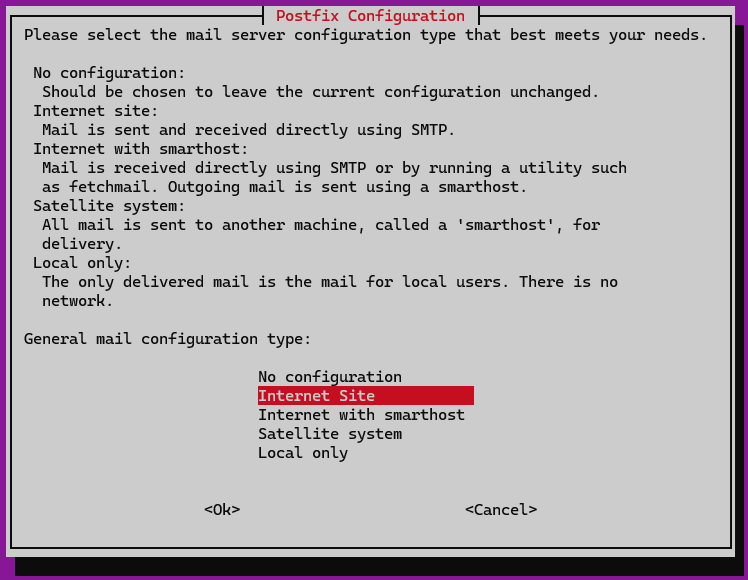

# AIDE

Advanced Intrusion Detection Environment (AIDE) sandbox.

> [!TIP]
> Commands to install and configure AIDE were referenced from [CIS Benchmarks](https://downloads.cisecurity.org/#/)

## Install

### Start a Linux VM

This example will use VirtualBox. Use the [VagrantFile](./VagrantFile) template to start your box:

```sh
vagrant up
```

### Install AIDE packages

Install AIDE:

```sh
# Upgrade all packages
sudo apt update && sudo apt upgrade -y

# Install AIDE
sudo apt install -y aide aide-common
```

You'll be prompted to configured Postfix. Selecting `No configuration` will do it for now.




### Initiate AIDE

Initiate AIDE:

```sh
sudo aideinit
```

Check the output:

```
$ sudo ls -l /var/lib/aide/
total 48576
-rw------- 1 root root 24868906 Apr 17 17:14 aide.db
-rw------- 1 root root 24868906 Apr 17 17:14 aide.db.new
```

Copy the new DB over the baseline:

> [!TIP]
> You may choose to `cp` or `mv`

```sh
sudo cp /var/lib/aide/aide.db.new /var/lib/aide/aide.db
```

### Running AIDE

T

```sh
sudo aide --check --config=/etc/aide/aide.conf
```


## Configuration

Configuration file:

```sh
/etc/aide/aide.conf
```

```
/var/lib/aide/
```

sudo aide --init --config=/etc/aide/aide.conf

https://manpages.debian.org/unstable/aide/aide.conf.5.en.html

```sh
sudo cp /var/lib/aide/aide.db.new /var/lib/aide/aide.db
```

https://aide.github.io/doc/


### Run Daily

```sh
sudo cp /usr/share/doc/aide/examples/aide.cron.daily /etc/cron.daily/aide
sudo chmod +x /etc/cron.daily/aide
```

```sh
sudo mv /etc/cron.daily/aide /etc/cron.daily/aide.disabled
```

## Other

### Verify AIDE Installation

You can run the following commands to verify if AIDE is installed:

```sh
dpkg-query -s aide &>/dev/null && echo "aide is installed"
# aide is installed

dpkg-query -s aide-common &>/dev/null && echo "aide-common is installed"
# aide-common is installed
```
